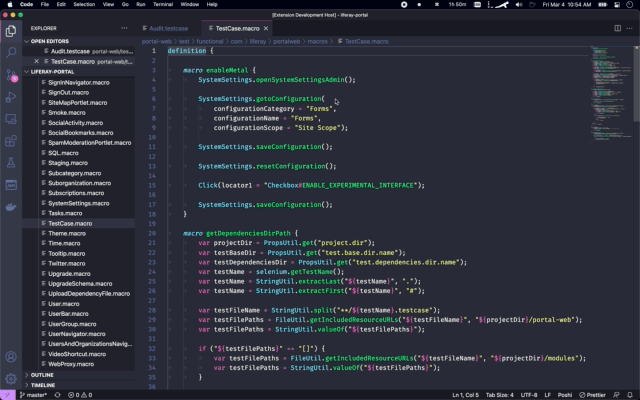
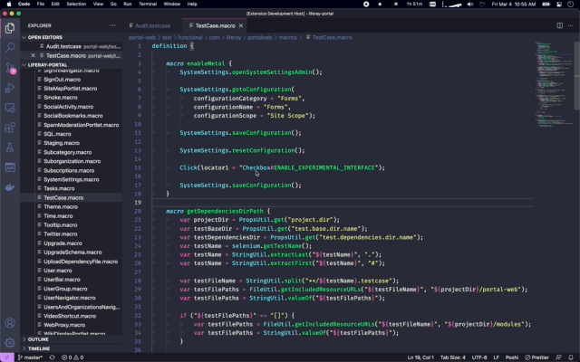
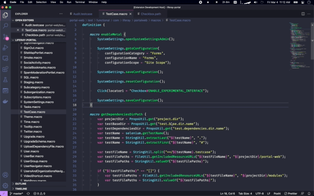
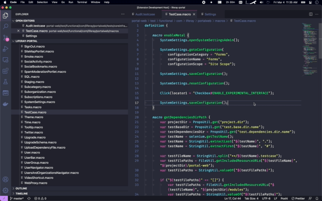

# Poshi Language Support for VS Code

## Features

### Go To Definition

Navigate to definitions using `F12` or using the **Go to Definition** command.

#### Go to function/macro file


#### Go to function/macro definition



#### Go to path file



#### Go to locator definition



### Completion

Disabled by default. Can be enabled with the **Poshi > Completion: Enabled** setting.

#### Function/Macro completion



### Formatting

Source formatting powered by Liferay's Source Formatter.

Disabled by default. Can be enabled with the **Poshi > Source Formatter: Enabled** setting.

A Source Formatter standalone jar from [repository.liferay.com](https://repository.liferay.com/nexus/content/repositories/liferay-public-releases/com/liferay/com.liferay.source.formatter.standalone/1.0.0/.) is required for this to work. Auto-fetching the jar will be available in the future.

This is a work in progress. If enabled, it is recommended that you disable format on save for now and invoke it manually.

## Extension Settings

```json
"poshi.completion.enabled": {
    "description": "Specifies whether or not to enable auto-completion.",
    "default": false,
    "type": "boolean"
},
"poshi.goToDefinition.enabled": {
    "description": "Specifies whether or not to enable go-to-definition.",
    "default": true,
    "type": "boolean"
},
"poshi.sourceFormatter.enabled": {
    "description": "Specifies whether the to use Liferay's Source Formatter as the formatter for Poshi files.",
    "default": false,
    "type": "boolean"
},
"poshi.sourceFormatter.jarPath": {
    "markdownDescription": "The path to the source-formatter-standalone jar. It will be invoked with `java -jar {}`.\nExample: `file:///Users/me/Documents/source-formatter-standalone.jar`",
    "default": "",
    "type": "string",
    "format": "uri"
}
```

## Release Notes

### 0.0.2

Adds License and README.md descriptions.

### 0.0.1

Initial test release
